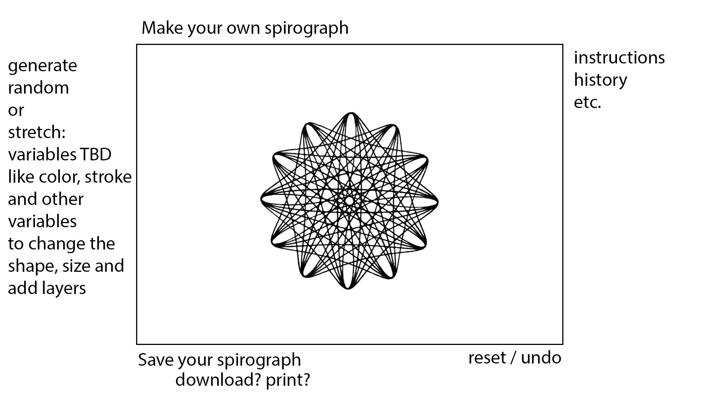

# Spirographer
Spirograph Generator using D3.js 

include TBD:
- describe spirographs and explain the equation? (include youtube demos?) 
- why I want to learn D3
- why I chose spirographs, my love and nostalgia (see photos)

**MVP Goal:**
- as a user I want to be able to view randomly generated spirographs

**Stretch Goals:**
- as a user I want to be able to manipulate and create my own spirograph
- as a user I want to be able to add multiple layers of spirographs to create beautiful art
- as a user I want to be able to download or print my spiro-art

**Super-Stretch Goals:**
- as a user I would like to setup an account (sign in)
- as a user I would like to save my spiro-art in my account
- as a user I would like to share and also see other users' spiro-art

**Wireframe(s):**

**Sprints:** 

Saturday 
- D3 tutorial and readings
- research spirographs

Sunday
- implement borrowed spirograph equation (credit: https://bl.ocks.org/nbremer)

Monday
- set up repo for the project 
- rough draft of read me 
- study the borrowed spirograph (and other equations online)
- google D3 syntax in borrowed example for updated D3 implementation 
- start setting up D3 in project repo

Tuesday
- continue to study the borrowed code syntax and equations
- continue to set up my own equation & code 
- style the page
- generate random spirograph, MVP!!!

Wednesday
- circle back to stretch goals
- decide about react, do I need back end, etc? 
- create a user form element for manipulating spirograph equation

Thursday
- work on user form and equations

Friday 
- style the shit out of my new amazing website

Saturday 
- finishing touches
- deadline 6:45pm, go get 2nd vaccine shot! 